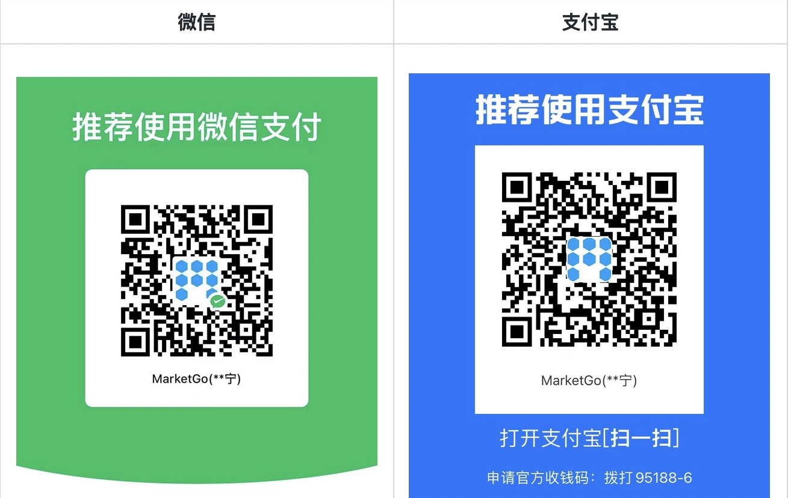

<div align=center></div>

&emsp;

<div align="center">

[官方网站](http://www.marketgo.cn/#/)  |  [版本发布](https://docs.qq.com/doc/DUk9hSlhxUlRXb0RV)  |  [获取演示demo](https://docs.qq.com/doc/DUkZmZ0lsbGdNU0dU)

</div>

<p></p>
<p></p>
<p></p>
<p></p>

---

****商业版新发布release 2.1.0的版本，说明如下：****

1、【新增功能】会话存档--为保障客户服务质量、提高内部协作效率和监管合规等原因，企业微信提供会话内容存档功能。企业可以统一设置存档的员工范围，并获取开启存档员工的工作沟通内容，满足企业的外部监管合规和内部管理需求。

---

# 一、概述

## 1.1、行业背景

国外的营销触达通道比较单一，主要以EDM为主。国内因为渠道的变化营销场景就复杂很多，当前国内做用户的营销触达主要的场景通道都有哪些。

- 企业微信（私聊、社群、朋友圈）
- 微信运营（公众号、小程序、视频号）
- 电商运营（抖音、快手、淘宝、京东、拼多多）
- 公域运营（短信、邮件、APP弹窗、PUSH推送、banner位）
- 其他

虽然国内已经有非常多的 MarTech 公司做出了非常优秀的 SaaS 产品服务，但是国内的市场需求依然没有得到充分满足。主要体现在以下几点：

- **<font color=Red>痛</font>**---企业更注重客户的数据安全，私有化部署意愿强烈。
- **<font color="#dd0000">痛</font>**---经营场景复杂，需要同全域经营场景打通做一体化营销，而不是单纯的买一套系统工具。
- **<font color="#dd0000">痛</font>**---需要源代码，越来越多的企业开始选择自建，以打造出更适合自己业务的营销系统。其背后的主要原因就是市场上直接采购的 SaaS 标准工具“不业务”。

基于以上的痛点若稍具规模的企业想要解决以上问题，只有自建一条路，但是选择自建碰到最大的问题就是：

**0-1 自建周期成本高**

一个复杂的营销自动化系统从 0-1 开发出来并没有想象的那么简单，都需要浪费大量的人力和物力，甚至短期内是看不见什么成果的，很容易导致不了了之。那么有什么好的办法能解决呢？

## 1.2、MarketGo简介

 基于以上背景，国内开源的营销自动化项目寥寥无几，MarketGo 在此背景下特意开源出来，以为国内数字化营销贡献绵薄之力

MarketGo 是一个营销引擎，通过提供的标准化功能和基础能力，让开发者能快速搭建适合自己企业的营销系统，快速完成从 0-1 的过程，并且能基于开放的能力和源码，开发深度融合自身业务的营销系统。

MarketGo 作为领域的产品新秀，也需要一步一个脚印逐步向前迈进。对未来的发展主要分以下几个阶段：

- **构建私域SCRM营销平台**

> 此阶段我们结合了当下私域营销的趋势，选择了优先从企业微信SCRM场景切入。
> 在这个阶段我们会提供个比较基础的企业微信SCRM功能，保留了其灵活的扩展性，便于开发者能够快速基于 MarketGo 开发自己想要的 SCRM 功能。

- **全域营销基础能力搭建**

> 此阶段我们会重点完善平台的全域营销能力，我们会接入更多的营销场景通道、人群圈选能力、任务下发能力、内容导入能力、自动化能力等。

- **自动化场景快速迭代**

> 此阶段我们会快速基于场景构建全域营销自动化方案。

# 二、产品功能

<div align=center></div>

MarketGo的优势：

1. **以私域SCRM为切入点，但不是终于私域SCRM**，我们要提供全域的营销解决方案；

2. **开发融合能力**，基于营销场景，可以整合内容、商城、CDP等上下游系统；

3. **微服务架构**，基于JAVA的前后端分离，微服务架构，可以便于企业快速敏捷的进行二次开发；

4. **专业的技术服务**，在toB的企业，产品和售后服务是同等重要的事情，我们有专业的售后团队，可以快速响应客户的技术、产品等问题。

# 三、项目介绍

### 3.1、项目结构

前端项目结构如下：

```
├── babel.config.js       --按需引入配置
├── package-lock.json     --结合了逻辑树和物理树的一个快照
├── package.json          --安装树
├── public                --公共文件
│   ├── favicon.ico       --网页标题的左侧小图标
│   └── index.html        --入口页面
├── src                   --源码文件
│   ├── App.vue           --根组件
│   ├── api               --api配置
│   ├── assets            --资源文件
│   ├── components        --公共组件
│   ├── main.js           --入口文件
│   ├── mixins            --js配置+公共变量
│   ├── router            --路由
│   ├── store             --状态库
│   ├── utils             --公共方法
│   └── views             --视图界面
└── vue.config.js         --配置文件
```

后端项目结构如下：

```
├── marketgo.sql           --系统的sql脚本
├── mktgo-api              --dubbo的接口定义
├── mktgo-biz              --业务module
├── mktgo-common           --公共依赖
├── mktgo-core             --业务核心公共模块，
├── mktgo-gateway          --网关服务，请求企微的接口
├── mktgo-react            --接收外部请求的modul，可以根据自己的客户量级，做成服务
├── mktgo-test             --测试项目
├── mktgo-web              --web服务
└── pom.xml                --公共依赖
```

客户端项目结构如下：

```
├── LICENSE
├── index.html              --入口页面
├── package-lock.json       --结合了逻辑树和物理树的一个快照
├── package.json            --安装树
├── public
│   └── env.js
├── src                     --源码文件
│   ├── App.vue             --根组件
│   ├── api                 --api配置
│   ├── imgs                --图片资源
│   ├── main.js             --入口文件
│   ├── pinia
│   ├── router.js
│   ├── utils               --公共方法
│   └── view                --视图界面
└── vite.config.js          --配置文件
```

### 3.2、技术框架

- 核心框架：SpringBoot 2.7.0
- 日志管理：SLF4J 1.7
- 持久层框架：spring-data-jpa   2.7.0
- RPC框架：dubbo 2.7.13
- 项目管理框架: Maven 3.6.0
- 前端框架：Vue 2.6.11
- UI框架: element-ui 2.15.9

### 3.3、开发环境

- IDE: IntelliJ IDEA 2019.2+
- DB: Mysql 5.7.37
- JDK: JDK 1.8
- Maven: Maven 3.6.1
- Redis:7.0.2
- Nginx: 1.12.2

## 3.4、部署流程

[服务器配置](https://docs.qq.com/doc/DUkNMRmVadGpOT2hD)

[端口配置](https://docs.qq.com/doc/DUnRKWGdIRlNkVU5z)

[环境准备](https://docs.qq.com/doc/DUnlkcGlWY2l2VlJq)

[前端部署](https://docs.qq.com/doc/DUmtMQllqQmVHTVpE)

[后端部署](https://docs.qq.com/doc/DUnBnb0FpWUpPd0dT)

## 3.5、定制开发

需要基于MarketGo做定制业务需求，请扫码添加好友咨询。

如果需要技术咨询支持，请支持299元，并附上你的微信号，按照捐赠的方式支付，我们会联系您并提供项目和安装的相关技术咨询支持。

|                              |                                                                       |
| ---------------------------- | --------------------------------------------------------------------- |
|   <br>业务咨询 |   <br>开源社群 |

# 四、开源说明

**开源不代表免费**

MarketGo的源码100%开源，遵守GPL-3.0协议。提供开发者学习和交流。

**绝不允许修改后和衍生的代码做为闭源的商业软件发布和销售！** 

如果需要将本产品在本地进行任何附带商业化性质行为使用，**请联系项目负责人进行商业授权**。

# 五、💪支持作者,捐赠

开源不易，坚持更难！如果您觉得MarketGo不错，可以捐赠一杯奶茶，在此表示感谢^_^。

当前我们接受来自于**微信**、**支付宝**的捐赠，请在捐赠时备注自己的昵称或附言。

您的捐赠将用于支付该项目的一些费用支出，并激励开发者们以便更好的推动项目的发展。

<div align=center></div>
